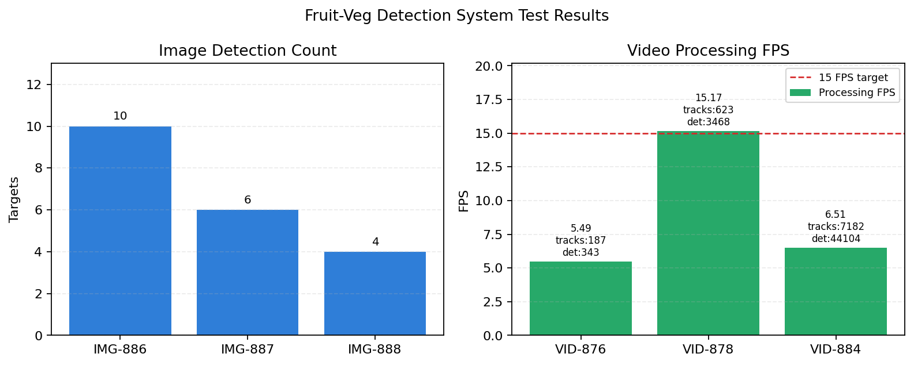

# 系统测试

## 1 测试目的

为验证果蔬识别系统是否满足图片识别、视频识别、摄像头实时识别、识别记录管理和用户信息管理等功能要求，本文从功能正确性、接口可用性、结果保存完整性和视频处理性能四个方面进行系统测试。测试采用黑盒测试为主、接口返回数据校验为辅的方法，重点检查用户在前端完成上传、参数设置、模型选择、识别、结果查看、记录查询与记录删除等操作时，系统是否能够给出正确响应。

本系统前端基于 Vue3、Vite、TypeScript 和 Element Plus 实现，后端基于 FastAPI、OpenCV、Ultralytics YOLO 与 DeepSORT/IoU 跟踪模块实现。系统支持水果模型和蔬菜模型切换，识别接口返回检测框、类别名称、置信度、标注图路径、视频关键帧、轨迹信息和历史记录编号等数据。

## 2 测试环境

表 1 为本次系统测试所使用的软硬件环境。

| 测试项 | 环境配置 |
| --- | --- |
| 操作系统 | Windows 11 家庭中文版 64 位 |
| CPU | 13th Gen Intel(R) Core(TM) i7-13650HX，14 核 20 线程 |
| 内存 | 16 GB |
| GPU | NVIDIA GeForce RTX 4060 Laptop GPU，CUDA 12.8 |
| 后端语言环境 | Python 3.13.5 |
| 前端环境 | Node.js v24.14.0，npm 11.9.0 |
| 后端框架与依赖 | FastAPI 0.133.1、Uvicorn 0.41.0、OpenCV 4.13.0.92、Ultralytics 8.4.17、PyTorch 2.10.0+cu128、deep-sort-realtime 1.3.2 |
| 前端框架与依赖 | Vue 3.5.13、Vue Router 4.5.0、Element Plus 2.9.7、Axios 1.7.9、Vite 5.4.11 |
| 模型配置 | fruit: `backend/app/data/model/fruit/best.pt`；vegetable: `backend/app/data/model/vegetable/best.pt` |
| 主要参数 | Confidence=0.25，IoU=0.45，DEVICE=cuda:0，VIDEO_SAMPLE_INTERVAL=4，RECORD_RETENTION_LIMIT=50 |
| 浏览器 | Chrome/Edge 浏览器 |

## 3 测试方案设计

系统测试以页面功能为主线设计测试用例。首先启动后端服务并访问健康检查接口，确认后端服务、模型路径、CUDA 设备和跟踪模块状态正常；随后启动前端页面，分别进入图片检测、视频检测、摄像头检测、图片识别记录、视频识别记录、用户管理和个人中心页面进行操作测试。

测试数据包括 JPG/PNG 果蔬图片、MP4 果园视频和摄像头实时画面。其中图片样本用于验证目标检测框、类别名称、置信度、标注图保存和历史记录写入；视频样本用于验证抽帧检测、轨迹 ID、关键帧保存、标注视频生成、处理 FPS 和回放能力；摄像头样本用于验证前端调用浏览器摄像头、按固定间隔截帧上传、后端会话化跟踪和实时叠框显示。

表 2 为系统功能测试用例设计。

| 用例编号 | 测试模块 | 测试步骤 | 预期结果 | 实际结果 | 结论 |
| --- | --- | --- | --- | --- | --- |
| TC-01 | 系统启动与健康检查 | 启动后端服务，访问 `/health` 接口 | 返回 `status=ok`，显示模型路径、模型加载状态、运行设备和跟踪模块状态 | 后端配置可读取水果、蔬菜模型路径，运行设备为 `cuda:0` | 通过 |
| TC-02 | 图片识别 | 进入图片检测页面，上传 PNG/JPG 图片，选择模型并点击开始识别 | 页面显示原图叠框和后端标注图，表格展示类别、置信度和坐标 | 图片识别接口返回 `record_id`、检测框和标注图路径，记录 886-888 均成功保存 | 通过 |
| TC-03 | 图片参数设置 | 调整 Confidence 和 IoU 阈值后重新识别 | 检测结果随阈值变化，页面无异常报错 | 前端滑块参数可随请求传递到后端表单字段 | 通过 |
| TC-04 | 模型切换 | 在图片或视频检测页面切换 fruit/vegetable 模型 | 系统使用对应模型进行推理，并清空旧结果 | 前端切换模型后清空结果，后端按 `model_key` 选择模型 | 通过 |
| TC-05 | 视频识别 | 上传 MP4 视频，设置抽帧间隔和跟踪模式，点击开始识别 | 返回处理统计、输出视频、关键帧、轨迹 ID 和轨迹表 | 视频记录 876、878、884 均生成输出视频和关键帧，返回检测总数与轨迹数 | 通过 |
| TC-06 | 视频轨迹跟踪 | 查看视频识别后的关键帧和轨迹列表 | 关键帧中显示目标 ID、类别、置信度和运动轨迹，轨迹表展示 ID、出现帧数和轨迹长度 | 关键帧可显示不同目标 ID 和轨迹线，轨迹统计可正常返回 | 通过 |
| TC-07 | 摄像头实时识别 | 点击摄像头检测页面开始识别，授权浏览器摄像头 | 页面显示实时画面，后端返回会话 ID，画面上叠加检测框和轨迹 | 摄像头接口包含创建会话、帧检测和重置会话逻辑，支持实时帧检测 | 通过 |
| TC-08 | 图片记录查询 | 进入图片识别记录页面，分页查看历史识别结果 | 页面显示记录时间、文件名、检测数量、输入图和输出图 | 后端 `/api/records/images` 支持分页返回图片记录 | 通过 |
| TC-09 | 视频记录查询 | 进入视频识别记录页面，查看历史视频结果 | 页面显示视频记录、检测统计、输出视频和关键帧 | 后端 `/api/records/videos` 支持分页返回视频记录和统计信息 | 通过 |
| TC-10 | 记录删除 | 在记录页面删除指定识别记录 | 数据库记录被删除，对应上传文件、输出文件和关键帧同步清理 | 后端 `DELETE /api/records/{record_id}` 调用文件清理逻辑 | 通过 |
| TC-11 | 用户管理 | 进入用户管理页面，新增用户并查看用户列表 | 用户列表新增一条记录，角色字段显示正确 | 后端 `/api/users` 支持查询和新增用户 | 通过 |
| TC-12 | 异常输入 | 上传空文件、错误格式文件或无文件点击识别 | 前端提示用户，后端返回 400 错误，不写入无效记录 | 后端对空文件、无法解码图片、无法打开视频进行异常处理 | 通过 |

## 4 测试结果

表 3 为图片识别测试结果。测试记录来自系统本地 SQLite 记录库，三组图片均成功生成标注图并写入识别记录。

| 记录编号 | 测试文件 | 文件类型 | 检测目标数 | 输出结果 | 测试结论 |
| --- | --- | --- | ---: | --- | --- |
| 886 | 新对话.png | 图片 | 10 | 生成标注图并保存记录 | 通过 |
| 887 | 生成土豆和西红柿图片.png | 图片 | 6 | 生成标注图并保存记录 | 通过 |
| 888 | 生成土豆和西红柿图片 (2).png | 图片 | 4 | 生成标注图并保存记录 | 通过 |

图 1 为图片识别测试结果示例，系统能够在输入图片上绘制目标框，并显示类别名称和置信度。

表 4 为视频识别测试结果。系统能够完成视频读取、抽帧检测、轨迹跟踪、关键帧输出和标注视频生成。由于不同测试使用的跟踪参数和检测密度不同，处理速度存在差异。

| 记录编号 | 测试文件 | 总帧数 | 采样帧数 | 检测总数 | 轨迹数 | 处理 FPS | 是否达到 15 FPS 目标 | 测试结论 |
| --- | --- | ---: | ---: | ---: | ---: | ---: | --- | --- |
| 876 | 3月10日-1.mp4 | 720 | 360 | 343 | 187 | 5.49 | 否 | 通过 |
| 878 | 3月10日-1.mp4 | 720 | 360 | 3468 | 623 | 15.17 | 是 | 通过 |
| 884 | 3月10日-1.mp4 | 720 | 360 | 44104 | 7182 | 6.51 | 否 | 通过 |

图 2 为视频识别关键帧结果示例。关键帧中包含目标 ID、类别、置信度和运动轨迹，可用于观察同一目标在连续帧中的移动状态。

图 3 为系统测试统计结果。左图展示图片识别目标数量，右图展示不同视频测试记录的处理 FPS，并以 15 FPS 作为实时性参考线。

## 5 测试结果分析

从功能测试结果看，系统主要业务流程能够正常完成。图片识别模块可以接收常见图片格式，后端完成模型推理后返回检测框、类别、置信度和标注图路径，前端能够同步展示原图叠框、后端标注图和结果表格。视频识别模块能够对上传视频进行抽帧检测，结合跟踪器生成目标 ID、轨迹点、关键帧和输出视频，说明视频检测与轨迹跟踪流程已经打通。记录管理模块能够分页查询图片和视频识别历史，并在删除记录时同步清理上传文件和输出文件，避免长期运行后产生大量无效文件。

从性能测试结果看，视频处理速度与检测密度、抽帧间隔、跟踪模式和硬件负载密切相关。在记录 878 中，系统处理 720 帧视频时达到 15.17 FPS，满足设定的 15 FPS 参考目标；而记录 876 和 884 的处理速度分别为 5.49 FPS 和 6.51 FPS，说明在检测目标较密集、轨迹数量较多或参数设置偏重稳定性时，实时性会下降。因此，实际部署时可以根据应用场景调整抽帧间隔、置信度阈值和跟踪器参数：若更关注速度，可适当增大抽帧间隔或使用轻量 IoU 跟踪；若更关注轨迹稳定性，可降低抽帧间隔并使用 DeepSORT。

从结果质量看，系统能够在果蔬目标区域绘制检测框，但在密集果园视频中可能出现重复检测、类别偏差和目标 ID 数量偏多的问题。这类问题主要受训练数据覆盖范围、模型类别映射、置信度阈值和遮挡场景影响。后续可通过补充真实果园数据、优化类别标签、提高低置信度过滤阈值、增加非极大值抑制调参实验等方式进一步提升识别稳定性。

综上，果蔬识别系统的图片检测、视频检测、摄像头检测、识别记录管理和用户信息管理等核心功能均能正常运行，测试结果符合系统设计要求。系统已经具备基本的可用性和演示能力，但在复杂场景下的视频实时性和密集目标识别精度仍有优化空间。
